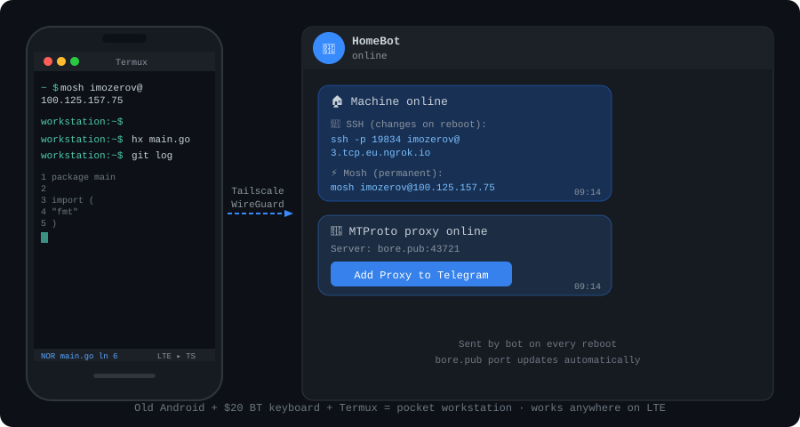

# lte-workstation

Turn any Linux machine into a remote workstation you can reach from your phone anywhere on LTE.

The idea is simple: **decouple screen from compute**. Your phone is just a terminal — it has a screen, a keyboard (Bluetooth, ~$20), and mobile internet. The Linux machine does the actual work. You connect them with [mosh](https://mosh.org) over [Tailscale](https://tailscale.com), which gives you a connection that survives network switches, high latency, and bad LTE signal.

An old Android phone + a cheap Bluetooth keyboard + Termux + this setup = a full development workstation that fits in a pocket and works anywhere.

What that actually means in practice: your phone is just a screen and a keyboard. Every command you run, every file you edit, every process you start — it all happens on the Linux machine. The phone contributes nothing but input and display. Switch from WiFi to LTE mid-session, go through a tunnel, lose signal for a minute — mosh holds the connection and catches up silently. You can run an AI coding assistant, a full dev stack, long-running builds — anything — and control it from your phone over whatever internet you have.



## What you get

- **Permanent mosh connection** via Tailscale — stable IP, survives switching networks mid-session
- **SSH fallback** via ngrok — dynamic public URL, auto-notified via Telegram bot
- **Auto-notifications** — Telegram message with connection commands whenever your machine comes online
- **Auto-start on reboot** — everything comes back up without manual action
- **Optional: MTProto Telegram proxy** — for regions where Telegram is blocked (Russia, Iran, etc.)

## Prerequisites

You need these installed on your Linux machine before running setup:

| Tool | Purpose | Install |
|------|---------|---------|
| [Docker](https://docs.docker.com/engine/install/) | Runs MTG proxy container | distro packages |
| [ngrok](https://ngrok.com/download) | SSH tunnel with public URL | download binary → `~/.local/bin/ngrok` |
| [bore](https://github.com/ekzhang/bore) | TCP tunnel for proxy relay | `cargo install bore-cli` |
| [mosh](https://mosh.org) | Resilient SSH alternative | `sudo apt install mosh` |
| [Tailscale](https://tailscale.com/download) | Permanent private IP | package + `sudo tailscale up` |

You also need:
- A **Telegram bot token** — create one via [@BotFather](https://t.me/BotFather) → `/newbot`
- Your **Telegram chat ID** — message [@userinfobot](https://t.me/userinfobot)
- An **ngrok account** (free) — get your auth token at [dashboard.ngrok.com](https://dashboard.ngrok.com/get-started/your-authtoken)

## Setup

```bash
git clone https://github.com/genaforvena/lte-workstation
cd lte-workstation
./setup.sh
```

The script checks prerequisites, asks for your tokens, generates config, installs scripts, and enables systemd services. Run it once.

Your credentials are saved to `~/.config/remote-access/env` (chmod 600, never committed to git).

## How it works

```
Phone (Termux + mosh)  ──── Tailscale WireGuard ──── Linux VM
                                                           │
                                                    ngrok TCP tunnel
                                                    → public SSH URL
                                                           │
                                                  bore.pub TCP tunnel
                                                    → MTG proxy (optional)
                                                    → Telegram servers
```

On boot:
1. `ngrok.service` opens a TCP tunnel to port 22 and sends you a Telegram message with the SSH command and your permanent mosh address
2. `bore-mtg.service` (if enabled) sends two Telegram proxy buttons: one via your Tailscale IP (permanent, works on LTE where bore.pub may be blocked) and one via bore.pub (fallback)

The bore.pub port changes on restart — that's expected. The bot always sends the fresh link. **Use the Tailscale link on LTE.**

## Phone setup (Termux)

```bash
pkg update && pkg install termux-services mosh openssh
```

Connect:

```bash
mosh your-user@your-tailscale-ip
```

Get your Tailscale IP from the Telegram notification or by running `tailscale ip -4` on the VM.

> **Tip:** pair a Bluetooth keyboard with your phone. A $15–20 keyboard transforms the experience — you get proper modifier keys, Tab, arrow keys, and no on-screen keyboard eating half your screen.

## MTProto proxy (censored regions)

If Telegram is blocked on your LTE network, the optional proxy routes your Telegram traffic through this machine and out via your network's exit point. Setup prompts you for an SNI domain (fake-TLS camouflage) — pick a domain that's commonly accessed on your network:

- Russia: `yandex.ru`
- Iran: pick any unblocked local domain
- Other: `google.com`, `apple.com`, or any HTTPS site that isn't blocked

The proxy secret is embedded in the Telegram "Add Proxy" button the bot sends you.

### Sharing with others

`proxy-bot.service` runs an access-control bot on the same Telegram bot token. To share your proxy:

1. Send friends your bot link: `https://t.me/yourbotname`
2. They tap `/start` — you receive a notification with their Telegram handle and **Approve / Deny** buttons
3. Tap **Approve** — the bot sends them the proxy link automatically

**Owner commands** (send these to your bot):

| Command | What it does |
|---------|-------------|
| `/list` | Show all users and their status (approved / pending / denied) |
| `/revoke @username` | Cut off someone's access |

When the bore.pub port changes (service restart), all approved users are automatically sent the updated link — no manual re-sharing needed.

> **Note:** the bot needs `python3` and `python-telegram-bot==20.*` installed in `~/.local/venv/proxy-bot/`. The setup script handles this. Approved users receive the bore.pub link (publicly accessible); your personal Tailscale link is sent only to you.

## Terminal stack

Connectivity gets you in. The tools make it feel like a real workstation. This is what works well over mosh on a phone screen:

| Tool | What it does | Install |
|------|-------------|---------|
| [Helix](https://helix-editor.com) | Modal editor with LSP built-in, no plugin manager needed | `sudo apt install helix` or [binary](https://github.com/helix-editor/helix/releases) |
| [lazygit](https://github.com/jesseduffield/lazygit) | Terminal git UI, everything on one screen | `sudo apt install lazygit` |
| [zoxide](https://github.com/ajeetdsouza/zoxide) | Smarter `cd` — jump to any directory by partial name | `sudo apt install zoxide` |
| [yazi](https://github.com/sxyazi/yazi) | Terminal file manager, opens files in Helix | [binary releases](https://github.com/sxyazi/yazi/releases) |
| [fzf](https://github.com/junegunn/fzf) | Fuzzy finder for history, files, processes | `sudo apt install fzf` |
| [starship](https://starship.rs) | Cross-shell prompt, shows git state and context | `curl -sS https://starship.rs/install.sh \| sh` |

These tools are optimized for terminal use with no mouse — which is exactly what you have on a phone. Helix in particular is worth learning: it's modal like Vim but with LSP, tree-sitter, and multi-cursor built in, so you don't need to configure plugins to get a full IDE experience.

For yazi + zoxide integration (so directories you navigate to in yazi are learned by `z`), and Helix as yazi's default opener, see [genaforvena/dotfiles](https://github.com/genaforvena/dotfiles).

## Files

```
scripts/
  ngrok-notify.sh      # sends Telegram message with SSH/mosh commands on ngrok start
  bore-mtg.sh          # bore tunnel + proxy notifications + notifies approved users on port change
  proxy-bot.py         # access-control bot: approve/deny proxy requests from Telegram
  ngrok.service        # systemd user service
  bore-mtg.service     # systemd user service
  proxy-bot.service    # systemd user service
setup.sh               # one-time interactive setup
```

## Maintenance

**Rotate tokens:** edit `~/.config/remote-access/env`, then `systemctl --user restart ngrok.service bore-mtg.service`.

**Regenerate MTG secret** (e.g. to change SNI domain):
```bash
docker run --rm ghcr.io/9seconds/mtg:2 generate-secret --hex yandex.ru
# update MTG_SECRET in ~/.config/remote-access/env and ~/.config/mtg/config.toml
docker restart mtg
systemctl --user restart bore-mtg.service
```

**Check service status:**
```bash
systemctl --user status ngrok.service bore-mtg.service proxy-bot.service
journalctl --user -u proxy-bot.service -f
```
